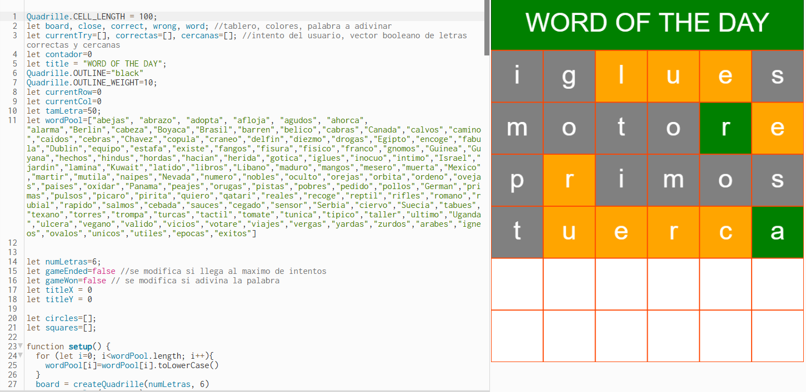

# 🌟 Wordle - JavaScript Version with p5.js

This project is a clone of the popular game **Wordle**, fully developed using **JavaScript**, **p5.js**, and the **p5.quadrille.js** extension for managing a visual grid. It's a fun and educational word guessing game where the player must guess a 6-letter word in a limited number of attempts.

## 🎮 How to Play

- You have **6 attempts** to guess a secret 6-letter word.
- After each guess, letters are marked with colors:
  - 🟩 Green: correct letter in the correct position.
  - 🟨 Yellow: correct letter in the wrong position.
  - ⬛ Gray: letter is not in the word.
- Use your keyboard to type the guess and press **Enter** to submit.

## 🧠 Technologies & Libraries Used

### 📦 [p5.js](https://p5js.org/)
A JavaScript graphics library used for:
- Drawing the game grid.
- Capturing keyboard events.
- Rendering letters and color feedback.

### 📦 [p5.quadrille.js](https://github.com/jagracar/p5.quadrille)
An extension for p5.js designed to handle grid-based visuals, perfect for board-style games like this one.
- Simplifies grid creation and manipulation.
- Allows each letter to be rendered as a colored tile.

### 📦 p5.sound.min.js
Sound library included for future use (not currently implemented).

## ⚙️ Main Functions in `sketch.js`

- `setup()`: Initializes the canvas, grid, and randomly selects a secret word.
- `draw()`: Continuously redraws the game board and updates visual state.
- `keyPressed()`: Handles user input for typing, deleting (`Backspace`), and submitting (`Enter`) guesses.
- `checkWord()`: Compares the guessed word to the secret and marks letters accordingly.
- `drawTitle()`: Renders the animated game title at the top of the canvas.

## 🚀 How to Run

1. Clone or download this repository.
2. Open `index.html` in any modern browser.
3. Start playing right away!

## 📌 Notes

- The word list is hardcoded in the `wordPool` array inside `sketch.js`.
- Only 6-letter words are accepted.
- You can edit or expand the word list directly in the code.

## 👤 Author

Created by [Sergio2205](https://github.com/Sergio2205)

---

Thanks for playing! Found a bug or have an idea to improve the game? Fork this repo or open an issue. 🚀
